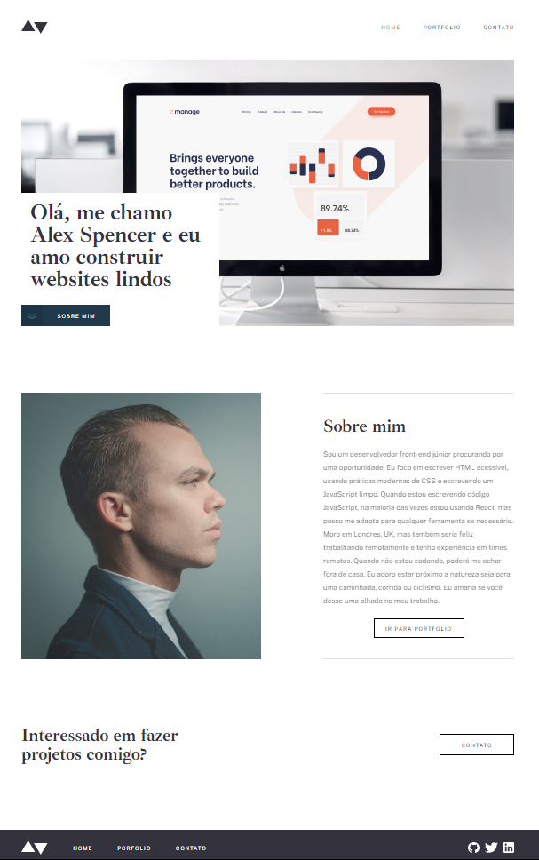

# Desafio | Front-end - Módulo 2
Este foi um desafio que eu fiz no final do segundo módulo do curso de Desenovlvimento de Software da Cubos Academy.
 
O objetivo era criar um website estático usando apenas HTML e CSS.
  

